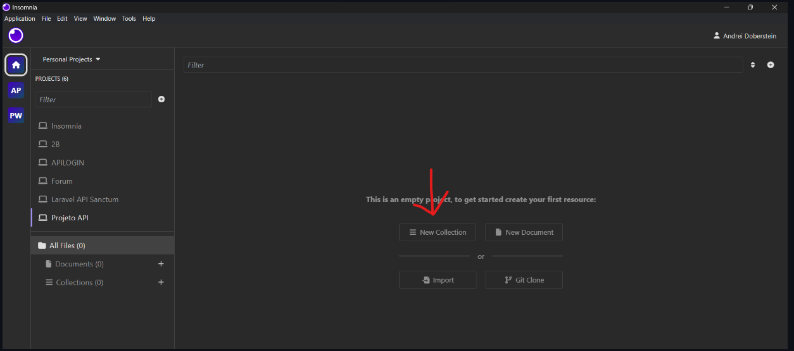
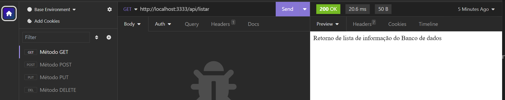
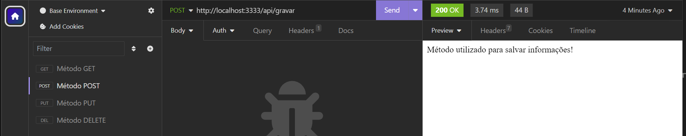
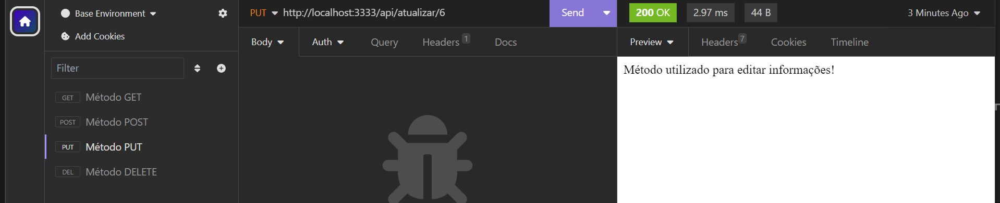
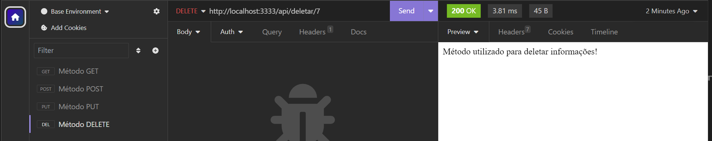

*Passo 1: Iniciação...*

Criar a pasta do projeto
```
mkdir "nome do projeto"
```

Acessar o projeto
```
cd "nome do projeto"
```

Criar arquivo para documentar
```
touch readme.md
```

Iniciar o gerenciador de pacotes do node
```
npm init -y
```

Instalar os pacotes
```
npm i express nodemon dotenv
```

Abrir no VSCode
```
code .
```

Cria o arquivo .gitignore 
```
nano .gitignore
```

Adicionar no .gitignore o nome da pasta
```
node_modules
```

Criar arquivos na pasta src
```
touch src/app.js
```

Arquivo responsável por criar a configuração da api
```
touch src/server.js
```

Arquivo que recebe as configurações e roda a api
```
mkdir src/config
```

Pasta que gerencia a conexão com o banco de dados
```
mkdir src/controllers
```

Pasta que gerencia as requisições das rotas e a conexão com banco de dados
```
mkdir src/routes
```

*Passo 2: Após o git clone...*


Criar o arquivo .env na raiz do projeto para armazenar as variáveis que serão reutilizadas na aplicação
```
nano .env
```

Digitar no .env, essa variavel contém a porta que o servidor está rodando
```
PORT = 3008
```

Adicionamos o .env no .gitignore
```
nano .gitignore
.env
```

Criar arquivo de exemplo para as variaveis necessárias da aplicação
```
nano .env.example
```

Adicionar ao arquivo .env.example
```
PORT = 
```

Importar os pacotes do express (servidor) no arquivo app.js
```
const express = require('express');
```

Importar o pacote dotenv, gerenciador de variavies no app.js
```
const dotenv = require('dotenv').config();
```

Instalar o express na variavel app
```
const app = express();
```

Setar a porta do servidor a partir do .env
```
app.set('port', process.env.PORT || 3333);
```

Exportar as configurações na variavel app
```
module.exports = app;
```

Importar o arquivo app no server.js
```
const app = require('./app');
```

Importar a porta do servidor no server.js
```
const port = app.get('port');
```

Testar API com a função listen (no server.js)
```
app.listen(port, () => {
    console.log(`Running on port ${ port }!`);
});
```

Abrir o package.json para executar, substituir o comando test
```
"start":"nodemon src/server.js"
```

Rodar o comando no terminal com Git Bash
```
npm run start
```

*Passo 3: Após o git clone...*

Criar arquivo routes dentro da pasta src
```
mkdir src/routes
```

Criar arquivo dentro da pasta routes
```
touch src/routes/rotas.js
```

Digitar códigos dentro do arquivo rotas.js
```
// Importar o modulo de Router do express
const { Router } = require('express');

// Instanciar o Router na variável router
const router = Router();

router.get('/listar', (request, response) => {
    response.send('Método GET: listar informações');
});
router.post('/cadastrar', (request, response) => {
    response.send('Método POST: salvar informações');
});
router.put('/user/:id', (request, response) => {
    response.send('Método PUT: atualizar informações');
});
router.delete('/user/:id', (request, response) => {
    response.send('Método DELETE: remover informações');
});

module.exports = router;
```

Digitar códigos dentro do arquivo
app.js, importar o arquivo de rotas nas cofigurações da api
```
const router = require('./routes/rotas');
```

Digitar código dentro do arquivo 
app.js, habilitar as rotas na aplicação
```
app.use('/api', router);
```

*Passo 4: Após o git clone...*

Criar um novo projeto no Insomnia


Criar uma coleção de requisições para esse projeto


Escolher um nome para essa coleção


Criar as requisições necessárias para a API clicando no botão 'New HTTP Request'


Executar a ação da rota no botão "Send"


*Testando os Métodos...*

Método GET


Método POST


Método PUT


Método DELETE


*Passo 5: Após o git clone...*

Criar a pasta "controller" dentro de src
```
mkdir scr/controllers
```

Criar arquivo "crudController" dentro da pasta controller
```
touch src/controllers/crudController.js
```

Colocar os códigos no crudController
```
function listarDados(request, response) {
    response.send('Retorno de lista de informação do Banco de dados');
}

function gravarDados(request, response) {
    response.send('Método utilizado para salvar informações!');
}

function atualizarDados(request, response) {
    response.send('Método utilizado para editar informações!');
}

function deletarDados(request, response) {
    response.send('Método utilizado para deletar informações!');
}

module.exports = {
    listarDados,
    gravarDados, 
    atualizarDados, 
    deletarDados
}
```

Alterar o arquivo rotas.js
```
// Importar pacote do express
const { Router } = require('express');
// Instanciar o Router na variavel router
const router = Router();
// Importar funções do controller para a rota acessar as funções
const { 
    listarDados,
    gravarDados,
    atualizarDados,
    deletarDados
 } = require('../controllers/crudController');

router.get('/listar', listarDados);

router.post('/gravar', gravarDados);

router.put('/atualizar/:id', atualizarDados);

router.delete('/deletar/:id', deletarDados);

module.exports = router;
```

*Testando os Métodos no Insomnia...*

Método GET


Método POST


Método PUT


Método DELETE

